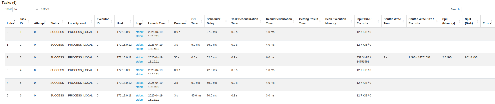

# Ch01: Pilares
- O **Skew** no spark e um particionamento desigual, gerando arquivos muito grandes e muito pequenos para processar juntos e trocar informações.
- O **shuffle** (movimentacao de dados entre as particoes) acontece entre os stages.
- "**Spill**" no Spark é o processo de gravar dados temporariamente no disco quando a memória é insuficiente, ajudando a evitar estouros de memória, mas podendo afetar o desempenho.
- Sempre que aparecer uma etapa de **Exchange** vai ser onerosa: Redistribuição de dados entre diferentes nós do cluster
- A **"Whole-Stage Code Generation"** no Apache Spark compila toda a lógica de uma consulta em um único bloco de código, otimizando o desempenho ao reduzir a sobrecarga de chamadas de função (Ela faz skip de varias coisas e agrupa)
    - Exemplo, faco um filter, group by e um sort.
    - Na sequencia faco um show
    - Quando faco uma acao o driver vai criar um plano de execucao. O wsc vai fazer um bytecode agrupando as tres transformacoes em um stage. Isso faz reduzir a quantidade de instrucoes na cpu.
- **Catalyst Optimizer**: 
    - O driver recebe o plano de execucao
    - Analise e gera um plano logico
    - Gera varios planos fisicos e escolhe o melhor
    - Quebra o plano fisico em tarefas (rdds)
    - Cria o wholeStageCodegen -> agrega as tarefas em bytecode
    - **Adaptive Querie Execution**
        - Atua apos o wholeStageCodegen
        - Reparticiona os dados automaticamente
        - Otimiza joins automaticamente
        - Lida automaticamente com problemas de skew
        - Reotimização de particoes automaticamente apos shuffle
    

### Exemplo Análise do history de um job Spark
#### Nivel do Job

- Total Atividades:12
- Qtde Cores: 6 (2 por worker)
- Tempo GC (gerencia alocacao e liberacao memoria): 2.3minutos
- Tamanho Input Dados: 714.6 
- Qtde Shuffle (Read memoria pro disco, Write disco pra memoria): 1GB

- 4 jobs gerados para a execução
- O job_id 1 foi o que mais demorou pra executar (executou 1 stage com 6 tarefas em 51 segundos)
#### Nivel do Stage

- O job_id 1 recebeu um input de 357MB e embaralhou 1GB.

- Demorou 1 minuto pra executar (nao necessariamente demorou 1 minuto, mas somando o tempo que os nodes demoraram, por exemplo node 1 demorou 30s e node 2 demorou 30s, tempo total 60s)
- As atividades mais demoradas foram de computacao no cluster 0
- As tasks estao bem distribuidas ja que todos os nós executaram 2 tasks cada
#### Nivel da Task

- Teve 6 tasks, sendo que a task 3 foi a responsavel pelo shuffle

### Exemplo estimativa de recursos
>> **Alocação de Recursos:**
    - Horizontal (aumentar maquinas): quando precisar de mais paralelismo, tiver muitos arquivos para serem processados. Mais usada.
    - Vertical (aumentar recursos): processa melhor tarefas mais pesadas ja que nao vai precisar movimentar muito os dados entre as maquinas.
    - Usar 3-4x particoes que a qtde total de executores.
    - Usar 2-4GB de memoria por node pra dar conta do spill.
    - Uma boa configuração: 4 cores, 16g memoria, 3 nodes (12 cores, 48GB memoria)

- Qtde dados/dia: 100GB
- dias/mes: 30
- SLA: 1h 
- Total Mes: 100 * 30 = 3TB
- Particao Default: 128MB
- Numero estimado particoes/dia = 100GB / 128MB = ~781 particoes
- Executores
    - Total Tasks: 781
    - 781 / 60 minutos = 13 tasks / minuto (13 cores necessarios)
- Memoria
    - Cada core com 2GB memoria
    - 13 * 2 GB (ou 4GB, se preferir por causa do spill)  = 26GB memoria necessaria

- Logo, uma configuracao padrao com 4 cores (13 / 3 = ~4), 16 GB memoria (4 cores x 2GB)

NOTA. Parâmetros para configurar recursos no spark. Dinamico faz autoscaling.

### Exemplo analise plano execucao querie
1. Plano Logico:
  - Sera feito um join inner usando a coluna business_id dos dois datasets
  - E feita uma subquery em r (alias de reviews), selecionando as colunas, em um arquivo parquet
  - E feita uma subquerie em b (alias de business), selecionando as colunas, em um arquivo parquet

2. Analyse Plano Logico
    - Analisa os tipos das colunas
    - Analisa em que arquivo cada uma das colunas esta
    - Otimiza o Plano Logico

3.Plano Logico Otimizado
    - O spark optou por filtrar os business_id (a chave de juncao) removendo os nulos antes de
    fazer o join.

4. Plano Fisico
    - Apos passar por um modelo de custo, o melhor plano fisico e selecionado
    - Neste plano:
        - A estrategia para fazer o join sera o SortMergeJoin, fazendo um inner entre os dois arquivos. Para cada um deles:
            - Faz um sort
            - Compara (exchange, shuffle) usando hashpartition nas as linhas para filtrar o que nao for nulo.
            - Converte as colunas do parquet para linhas
            -Escaneia o parquet pra levar pra memoria

>> ## **Estrategias de Join**
>> - **Sort Merge Join**: Ordena ambas as tabelas pelas chaves de junção e, em seguida, mescla as tabelas ordenadas, sendo eficiente para grandes conjuntos de dados que já estão ordenados ou podem ser ordenados rapidamente.
>> - **Broadcast Join**: Envia uma tabela pequena para todos os nós do cluster, permitindo que a junção ocorra localmente, o que é eficiente para tabelas pequenas.
>> - **Shuffle Hash Join**: Redistribui os dados com base nas chaves de junção, criando uma tabela hash em cada partição para realizar a junção, ideal para tabelas de tamanho médio.
>> - Existem outras mas nao vale mencionar