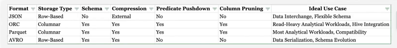
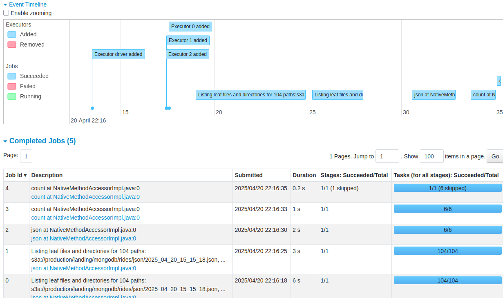
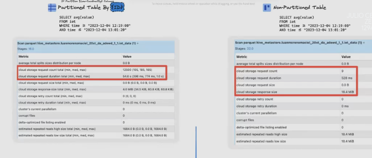
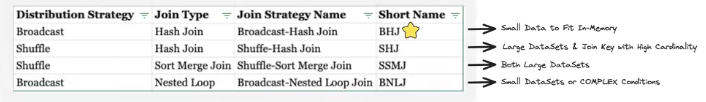
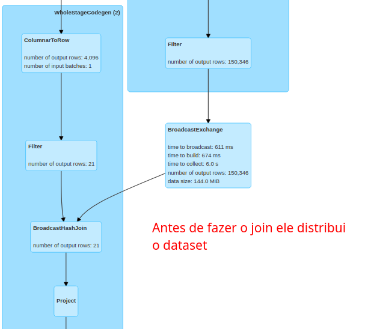
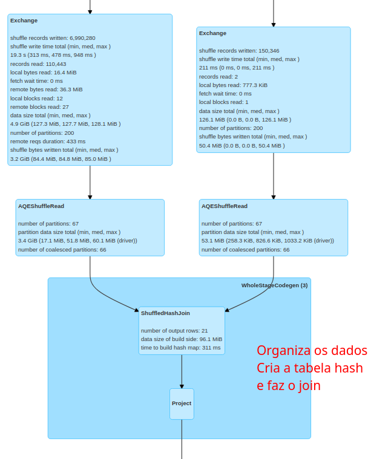
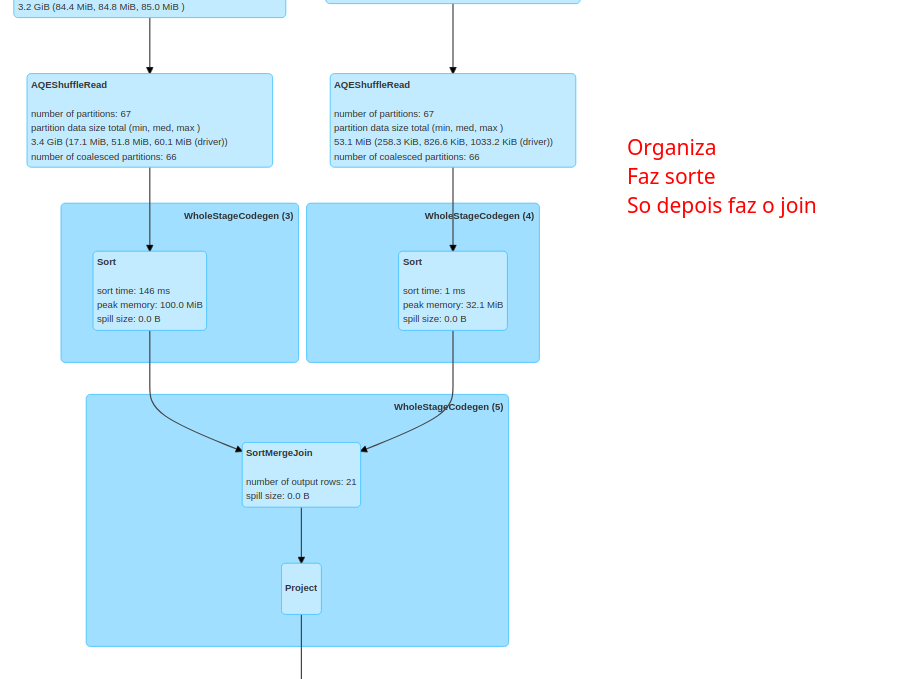
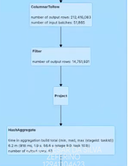
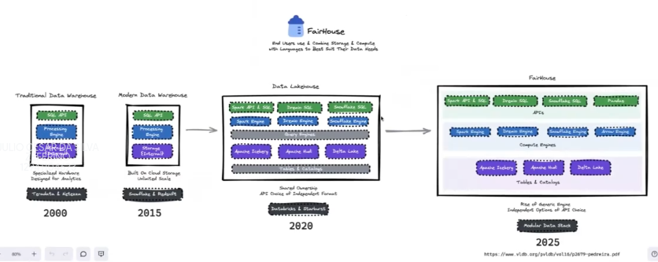

# Performance Tunning

- Principais causas problemas Tunning:
    - Performance:
        - Data skew
        - Overhead Shuffle
        - Small files
        - Alocação de recursos
    - Gerenciamento de Memoria
        - Estouro de memoria
        - Garbage Collection
    - Problemas Configuração
        - Parametros mal configurados
        - Versao dos packages/libs
    - Problemas Escalabilidade
        - Datasets muito grandes
        - Network bottlenecks (Problemas transmissao dados pela rede)
    - Problemas de Debugging
        - Logs Insuficientes
        - Dificuldade de enxergar a causa raiz

### Spark Measure

- captura dados da spark metrics dos jobs spark
- capta dados de stage, task, memory e tem varias integracoes
- pode captar nao apenas o codigo inteiro mas tambem etapas especificas do codigo
- https://github.com/lucacanali/sparkMeasure

### ANTI-PATTERNS
- **Inconsistencia no formato dos dados**
    - A miscigenacao de arquivos no data-lake e normal
    - O problema e quando nao usamos os formatos corretos na hora de processar
    - Usos dos tipos de arquivos data-lake:

>> Spark sempre vai preferir formatos baseados em coluna, porque permite pushdown e column pruning. Além disso, existem modulos spark escritos apenas para lidar com arquivos parquet.

>> O parquet, por padrão tem um particionamento de 128MBs.

>> Usamos arquivos orientados a coluna em sistemas OLTP em que eu quero que a querie retorne o maximo de informação (registros) de modo simples. Para olap, a querie e analitica, com filtros, remoção de duplicadas e selecao de colunas, dai o foco em formatos orientados a coluna.

>> Quando temos small files, grande parte do tempo do job sera listando os arquivos do bucket. Se usar um arquivo parquet o tamanho do file size consultado sera bem menor que o JSON, mesmo tendo small files ele ainda e mais eficiente.

- **File Explosion**
    - Problema do particionamento
    - O Hive Metastore 
        - A ideia e ir reduzindo a cardinalidade e tendo cada vez menos arquivos
        a medida que reduz a particao
        - banco/tabela/particao1=1/particao2=2
    - Hoje em dia o particionamento nao e mais eficiente
        - Gera small files
        - Voce começa a sobrecarregar o sistema de arquivos e gerar muito custo
        ja que vai ter uma quantidade muito grande de requisições.
        - Problemas de concorrencia e metadados de estatisticas ficam desatualizado.
        - Ninguem garante que todas as consultas sempre vao usar o campo particionado.
        - NAO PARTICIONE, a menos que tenha acima de 1 TB de dados!!!
        - Acima de 1TB usar liquid clustering.

- **Ignorar o Particionamento de Dados**
    - Por exemplo, tabela particionada pelo id do cliente e data
        - Em algumas particoes voce tem clientes que tem muitos registro
        - Alem de ter small files voce ainda tem problemas de dados com
        particoes desequilibradas
    - Se voce ignora a Skew, vo vai acabar com particoes extremamente grandes, 
    com as tasks relacionadas aquela particao executando eternamente prejudicando o paralelismo.
    - O ideal e sempre ter particoes distribuidas de modo proximo a homogeneidade.
    - **Como resolver o SKEW**:
        - Usando repartition
        - Usando coalesce
        - Usando um particionador customizado (combinando colunas, por exemplo)
        - Usando estrategia de salting keys

- **Alto uso do collect**:
    - Traz todos os dados dos executores para o driver
    - geralmente gera out of memory
    - Como evitar:
        - Usar show
        - Usar take

- **Transformacao Sequencial**:
    - Basicamente usar o spark sem aproveitar o paralelismo

- **JOINS ineficientes**:
    - Fatores que afetam um join no spark
        - Tamanho dos dados
        - Join hint
        - Tipo do Join
        - Cardinalidade das keys
        - Estatisticas da Tabela
    - Sempre tentamos evitar Shuffle e Sort no Spark

    - Broadcast Hash Join (BHJ)
        - Comparando um dataset grande com um dataset pequeno
        - Compartilha o dataset pequeno com todos os executores retirando a necessidade de shuffle
        - Por padrao o spark faz isso para datasets de 10mb
        - Hoje em dia podemos aumentar o valor a depender da quantidade de memoria dos executores, desde que nao onere. Se ultrapassar a memoria disponivel ele nao faz spilling e sim da out od memory.
        - Apos o join o espaco e liberado da memoria.

    - Shuffle Hash Join (SHJ)
        - Ele vai considerar que a menor tabela do dataset e 3 vezes menor que a primeira
        - Primeiro ele organiza as informações pelas keys (Shuffle), basicamente se eu escolho uma coluna de id, por exemplo, ele vai mover para o executor 1 os mesmos ids das duas tabelas, e vai distribuindo esses ids pelos executores sempre deixando os iguais no mesmo executor.
        - Cria uma tabela Hash falando onde estao os ids do menor dataset
        - Na sequencia, faz a juncao de forma performatica
        - Usamos para datasets grandes e com operacoes muito caras

    - Shuffle Sort Merge Join (SSMJ)
        - Muito oneroso
        - Organiza os dados pela chave
        - Faz um sort e depois faz o merge

### PATTERNS

#### Melhores Principios de Design

**Column Prunning e Predicate Pushdown**:
    - Serve para formatos de avro e parquet
    - Basicamente e aplicar filtros (predicate pushdown) e selecionar colunas (column prunning)
    - O spark so vai consultar os arquivos que tem exatamente o que voce precisa a partir das estatisticas
    - A ordem do filtro e otimizada pelo spark.
    - Devemos fazer isso na entrada do dado -> No primeiro select

**ReParticionamento de Dados Eficiente**:
    - Primeiro, usar o MAXPARTITIONBYTES quando conhecer o tamanho das particoes do dataset. Principalmente se voce estiver na silver lendo da bronze [3-4x a qtde de cores]. Pode ser problematico se tiver trazendo muitas particoes.
    - COALESCE: reduz a quantidade de particoes (só diminui, nao aumenta)
        - Nao gera shuffle, reduz as particoes no mesmo executor.
    - REPARTITION: +/- a quantidade de particoes
        - Oneroso, gera shuffle movimentando os dados entre os executores.

**Pandas API**:
    - Antigo Koalas
    - Mais friendly e com a mesma performance

**Caching entre os stages**:
    - Precisa ser usado com cuidado
    - O databricks tem varios recursos que fazem cache automatico
    - Geralmente usamos cache em datasets que serao usados por varios outros datasets (downstreans)
    - O cache vai jogar o dataset para a memoria de todos os executores.
    - Nem sempre possuimos memoria suficiente pra essa operacao em especial para datasets grandes, pra esses casos podemos usar o `persist(StorageLevel.MEMORY_AND_DISK)`.
    - Importante ter um unpersist
    - Precisamos usar uma action na sequencia pra ativar o persist. Um .count() por exemplo.

>> Fazemos o cache quando temos um dataset que faz varias computacoes que seriam caras e que sera utilizado por outros. Podemos remover no momento que tivermos um novo dataset menor que nao tenha tanta recomputacao onerosa.

**Usar a Hint de Broadcast**:
    - Ao fazer reparticionamento de dados
    - Ao otimizar joins
    - Ao fazer skew
    - Reotimizar as shuffle partitions

**Otimizar Shuffles*:
    - A ordem de execucao faz a diferenca no apache spark
    - O shuffle acontece durante os estagios e gera movimentacao de dados (Disk I/O, data serialization e deserialization, network I/O)
    - Exemplo:
        - tabela1 - 1 trilhao de linhas
        - tabela2 - 1 bilhao de linhas
        - tabela3 - 100 linhas

        - Inner Join tabela1 - tabela 2 -> tabela_j1 (com 1 bilhao de linhas)
        - Inner Join tabela_j1- broadcast(tabela3) -> tabela_j2 (com 500 linhas)

        - **Apenas 1 dos joins foi otimizado**

        - Inner Join tabela1 - broadcast(tabela3) -> tabela_j1 (com 500 linhas)
        - Innert Join broadcast(tabela_j1) - tabela2 -> tabela_j2 (com 500 linhas)

        - **Quando trocamos a ordem, podemos fazer dois joins otimizados e praticamente zerar o shuffle com broadcast**

>> O AQE tenta ao maximo fazer uma ordem mais correta

