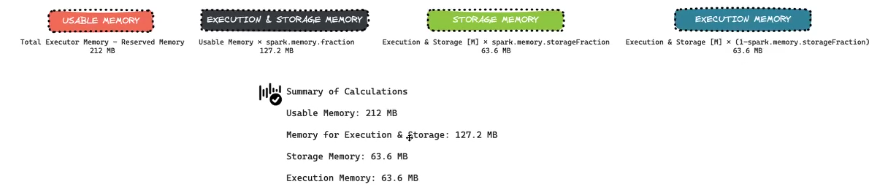

# Os 5s

# Shuffle
- Operacao mais comum do spark, nao como nao ter shuffle e sim como reduzir a quantidade de shuffle.
- O Exchange do plano de execução representa a organizacao dos dados entre os executores
- Sempre ocorre entre os stages para transformacoes do tipo Wide.
- Para datasets pequenos 
- Se carregar particao alem (ou a menor) do que o necessario no spark, teremos problemas. O ideal e manter as particoes razoavelmente no nivel do cluster. Por padrao o spark usa `spark.sql.shuffle.partition = 200` (o databricks tem "auto" como standard)
    - Exemplo: VM 12 CORES * 4 (3 a 4x) = 144 particoes 
    - Usar coalesce e repartition para resolver esses problemas, precisa tomar cuidado no tamanho das coisas que estao sendo processadas.
- Estrategias para reducao
    - Usar menos workers com mais recursos (3-5 workers)
        - reduz a quantidade de network I/O
        - usar ssds para acelerar o shuffle

# Spill
- Acontece quando o spark fica sem memoria pra processar e fica despejando os dados "extras" em disco. ["swap" do spark]
- A medida que a memoria for liberando, os dados sao novamente enviados do disco para a memoria.
- Causa saturacao de disco - usa muito o ssd
- Precisamos evitar spill
- Causas do Spill:
    - Shuffle muito pesado
    - Cache muito grande

>> Estrutura de Memoria do Spark
    - **Reservado**: em media 300MB do executor sao usados pra isso
    - **User**: armazena os dfs no executor
    - **Storage**: armazena o cache e dados de broadcast
    - **Execution**: usada pra processar shuffles, join e agregacoes
    - A alocacao e feita de modo dinamico por padrao (embora possamos configurar)
    - A area de Storage e Execution sao os mais importantes na execucao do job.

- **Se o total de tamanho da memoria reservado para Execucao e Storage exceder temos spill (ele vai gravar o restante no outro**)
- Ocorrem duas operações: SPILL MEMORY (dados em memoria que foram pro disco) e SPILL DISK (tamanho desses dados em disco, comprimido) -> Lembrando que em algum momento o valor em disco tende a voltar pra memoria

- Estrategias para reduzir o Spill:
    - Aumentar a memoria do worker
    - Resolver data skew
    - Gerenciar as particoes com maxPartitionBytes para reduzir a quantidade de particoes que pode gerar muita memoria alocada.
    - Reduzir operacoes cara, como explode(), por exemplo. Revisitar a logica do codigo.
    - Fazer unpersist de algum dataset cacheado ao longo do codigo pode ajudar, se ele nao estiver sendo mais usado, liberando a memoria.
    - Repensar o job para processar menos dados

- **Visualizar Spill no Spark UI**:

# Skew
    - Dados nao distribuidos de forma homogenea pelas particoes
    - Com isso, vamos ter tasks que demoram mais que as outras (Stragglers)
    - Geralmente tem tarefas pesadas e que demoram muito pra executar e ficam se sobrepondo (Nós subutilizados)
    - No codigo o skew geralmente vai aparecer quando eu filtro a particao que esta desbalanceada.

Stage sem problema de skill

Stage com problema de skill

    - Ter uma quantidade de spill muito diferente entre os executores dentro da mesma stage. Por exemplo, o ex01 teve 700mb de spill e o ex03 ter 4GB de spill
    - Ter uma quantidade de tasks muito grande, por exemplo minha quantidade ideal de particoees seria 24 (3~4x qtde de cores), mas tive 430 tasks (usei 430 particoes)
    - Como Mitigar o problema:
        - Isolar os dados com skew (Processar essa particao muito pesada em um outro job, por exemplo)
        - Ralizar um broadcast Hash Join para evitar o shuffle.
        - Utilização da tecnica de Salting keys
        - AQE para otimizar dinamicamente.

# Storage
    - Geralmente vai ser resolvido pelos formatos otimizados de arquivo
    - A persistencia via cache e persist (sempre respeitando a qtde de memoria pra nao ter muito spill)
        - Cache: joga pra memoria.
        - Persist: da mais opcoes. Mais usada: MEMORY_AND_DISK.
        - Fazer unpersist assim que possivel

# Serializacao
    - Conversao dos objetos para um formato eficiente antes de serem transferidos (movimentados) entre os executores via rede.
    - Ocorre sempre que existe shuffle (movimentacao de dados)
    - Porque ele e importante:
        - A comunicacao de rede é cara -> Precisamos garantir que o dado esteja em menor tamanho possivel (serializado)
        - Persistencia de Dados
        - Gerenciamento de dados em memoria
    - Mecanismo de Serializacao
        - Java Serializer
            - Padrao para JVM
        - Kryo Serializar
            - Mais rapido, gera arquivos menores
            - Spark usa ele pra operacoes de serializacao mais pesadas

> Quando executamos as funcoes built-in do spark ou scala, as funcao sao executadas dentro da JVM. Se escrever em python, vc vai usar o PY4j para abrir uma instancia python e executar la dentro, depois ele vai o processo contrario. O Pandas UDF usa o arrow e diminui essa latencia, embora nao chega perto do scala.

> O objetivo é nao usar UDF, mas se usar, usar uma pandas_udf.

> UDF geram bastante tem de GC e Shuffle

