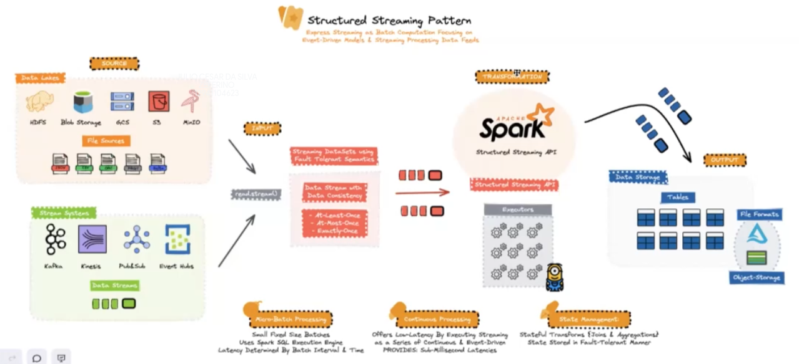
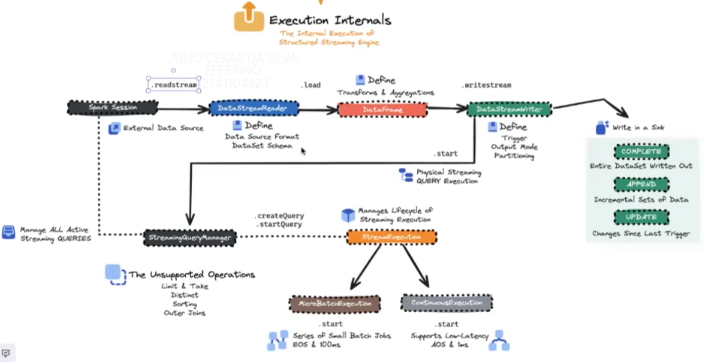
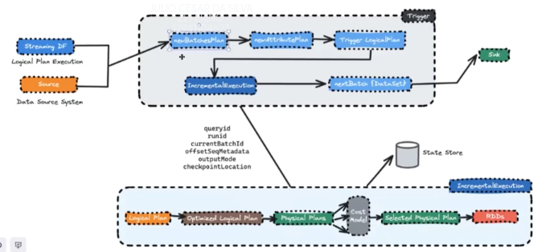
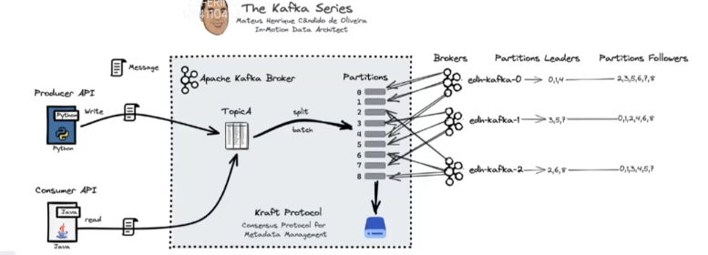

# Streaming
- O spark usava um streaming baseado em RDD
- Agora temos o structured streaming que e baseado na api de dataframe
- Tem tolerância a falhas.
- É um dataframe sem limite de tamanho, que sempre vai estar recebendo dados vindos de `micro-batchs`.
- A melhor prática hoje é ler de sistemas de streaming, como o kafka. Embora seja possivel ler de um data-lake.

- Incremental Execution

### Apache Kafka

- É um sistema de armazenamento
- Tem duas APIS totalmente desacopladas uma da outra
    - Producer: grava dados
    - Consumer: le dados
- Suporta falhas. Os dados dos topicos sao quebrados em particoes e replicados em servidores (brokers).
- Um dos brokers e definido como lider, se ele cai outro lider e eleito automaticamente. Antes essa "eleicao" era feita usando o zookeeper e tinha um gargalo quando tinham muitos brokers agora se usa o kraft que é um protocolo mais rápido.
- Um bom fator de replicação seria entre 3 e 5 mesmo que tenham muitos brokers ja que isso pode gerar latência se tiver um fator de replicação muito grande
- O kafka permite transações

### Spark + Kafka
>> Geralmente colocamos uma coluna de created_by com a data de criacao no sistema de origem e um ingestion time quando o dado chega no kafka. Depois que o spark escrever, gravar o processing time. Isso ajuda na auditoria e analise de time de processamento.

>> Uma boa pratica quando for ler stream coom spark, deixe um arquivo 'padrao' ou mais recente so pra pegar o schema de deixar isso mais automatizado.

- Windowing (usado para computacionar as coisas aos poucos e de modo continuo):
    - Sliding: vai sobrepondo as infos
    - Session: abre uma sessao (de 10min por exemplo), a cada 10 minutos ele computaciona os dados
    - Tubling: tem tempo fixo (1min por exemplo) pra computacionar.

- Continuous: permite passar um tempo para recuperar e deixar ainda mais online (usado em delta live tables por baixo dos panos.)
