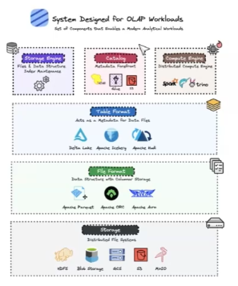
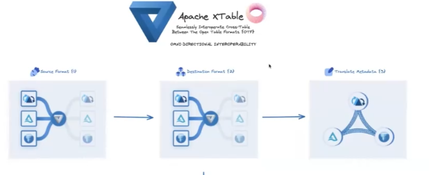
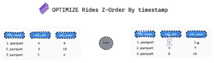
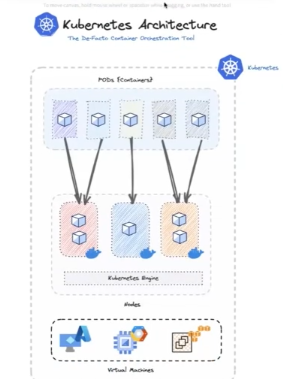
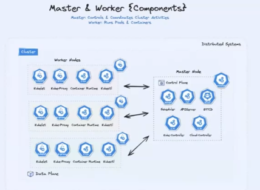
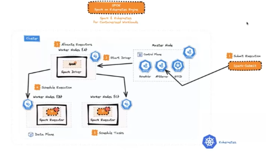

# Lakehouse
- Aberto e desacopla o armazenamento do processamento
- Fairhouse:
    - Combinamos as necessidades dos usuarios finais de armazenamento e queries
    - Local aberto
    - Unified Open Table Format

- Como os sistemas de analytics funcionam hoje

- Iceberg e Delta: Unifica as informações que precisam ser consultadas de forma inteligente.

- Apache XTable
    - Permite trabalhar coom cross formatos de tabelas
    - Cria uma especie de metadados universal que vai ser compativel com apache iceberg, hudi e delta

# Solucoes comuns para problemas
- ZORDER
    - Tecnica de ordenacao por coluna
    - Ele atualiza as estatisticas e evita que varios arquivos sejam consultados quando vc faz um filtro.

- LIQUID CLUSTERING
    - Pode mudar a distribuicao ao longo do tempo
    - O dado nao e reescrito, apenas os metadados
    - A partir das novas versoes do delta, a medida que vc bota queries na tabela ele se distribui automaticamente de forma automatizada.
    - Ele cria um layout automatico do arquivo, ajustando o tamanho dos arquivos, fazendo merge e monitorando a performance dos arquivos. Resolve problemas de particao, skew e etc.

# Kubernetes
- Se voce nao usa Databricks, o melhor seria usar spark com Kubernetes.
- SPOK (Spark on kubernetes)
- Os recursos sao provisionados e destruidos a medida que completam a computacao requerida.
- Tem um operador de spark (Agente especializado no kubernetes), ele é quem será nossa interface para configuracao e provisionamento dos recursos.
- Permite aproveitar o shuffle que ja foi realizado msm se o executor cair. Nao começa do inicio. `spark.dynamicAllocation.enabled=true` e `spark.dynamicAllocation.shuffleTracking.enabled=true`

